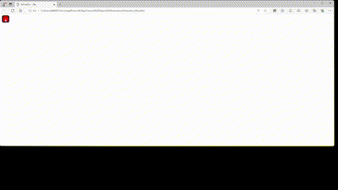

# Simple Object Animation Project

## A project about placing an object in multiple positions on the screen and creating an animated path with the positions where it was placed on the screen.

# Usage: 
The object can be placed anywhere on the screen. For the trajectory animation, right-click the mouse.

© [This project is my personal work.]
